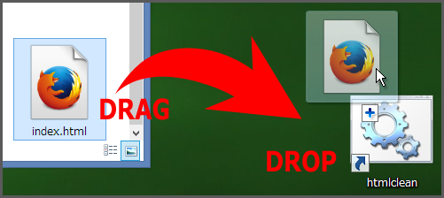

# htmlclean

* [Grunt](http://gruntjs.com/) plugin: [grunt-htmlclean](https://github.com/anseki/grunt-htmlclean)
* [gulp](http://gulpjs.com/) plugin: [gulp-htmlclean](https://github.com/anseki/gulp-htmlclean)

Simple and lightweight cleaner that just removes whitespaces, comments, etc. to minify HTML/SVG.  
This differs from others in that this removes whitespaces, line-breaks, etc. as much as possible.

## Removing
htmlclean removes the following texts.

+ The leading whitespaces, tabs and line-breaks, and the trailing whitespaces, tabs and line-breaks.
+ The unneeded whitespaces, tabs and line-breaks between HTML/SVG tags.
+ The more than two whitespaces, tabs and line-breaks (suppressed to one space).
+ HTML/SVG comments.

The more than two whitespaces (even if those are divided by HTML/SVG tags) in a line are suppressed.

**Example:**

Before

```html
<p>The <strong> clean <span> <em> HTML is here. </em> </span> </strong> </p>
```

After

```html
<p>The <strong>clean <span><em>HTML is here.</em></span></strong></p>
```

The whitespace that was right side of `<strong>` was removed, and the left side was kept.  
The both side whitespaces of `<em>` were removed.

## Protecting
The following texts are protected (excluded from removing).

+ The texts in `textarea`, `script` and `style` elements, and text nodes in `pre` elements.
+ The quoted texts in tag attribute.
+ The texts in SSI tags (PHP, JSP, ASP/ASP.NET and Apache SSI).
+ IE conditional comments. e.g. `<!--[if lt IE 7]>`
+ The texts between `<!--[htmlclean-protect]-->` and `<!--[/htmlclean-protect]-->`.
+ The texts that is matched by `protect` option (see "Options").

## Installation

```
npm install -g htmlclean
```

## Command Line Tool

```shell
htmlclean [options] [input [output]]
```

Command line tool needs `-g` option when install package.  
See `htmlclean -h` for usage.

### Example

* Clean `index.html`, and write to `index.min.html`.
```shell
htmlclean index.html
```

* Clean `index.html`, and overwrite it.
```shell
htmlclean index.html -o index.html
```

* Clean all HTML files in `src` directory, and write into `public` directory.
```shell
htmlclean src public
```

* Clean all SVG files.
```shell
htmlclean *.svg
```

* Clean web page on URL, and write to `index.html`.
```shell
wget -q -O - https://www.google.co.jp/ | htmlclean > index.html
```

* Clean and compress `index.html`, and write to `index.gz`.
```shell
htmlclean index.html - | gzip > index.gz
```

* Clean 3 files, and write into 1 file.
```shell
htmlclean -i head.html -i body.html -i foot.html \
-o index.html -o index.html -o index.html
```

### GUI Tip

If you have GUI (desktop) system (Windows, Mac, Ubuntu, etc.), drag-and-drop the target file or directory to `htmlclean` icon. The `htmlclean` icon is installed into directory of Node, usually. Or the short cut (alias, link, etc.) icon on desktop also works.  


## Node Module

```js
cleanHtml = htmlclean(sourceHtml[, options])
```

`require('htmlclean')` returns a Function. This Function accepts source HTML, and returns clean HTML. If you want, you can specify options to second argument (see "Options").

```js
var htmlclean = require('htmlclean');
html = htmlclean(html);

// Or
html = require('htmlclean')(html);
```

### Options
You can specify `options` Object to second argument. This Object can have following properties.

#### protect
Type: RegExp or Array

The texts which are matched to this RegExp are protected in addition to above "Protecting" list. The multiple RegExps can be specified via Array.

#### unprotect
Type: RegExp or Array

The texts which are matched to this RegExp are cleaned even if the text is included in above "Protecting" list. The multiple RegExps can be specified via Array.  
For example, HTML as template in `<script type="text/x-handlebars-template">` is cleaned via following.

```js
html = htmlclean(html, {
  unprotect: /<script [^>]*\btype="text\/x-handlebars-template"[\s\S]+?<\/script>/ig
});
```

The `x-handlebars-template` in `type` attribute above is case of using the Template Framework [Handlebars](http://handlebarsjs.com/). e.g. [AngularJS](https://angularjs.org/) requires `ng-template` instead of it.

*NOTE:* The RegExp has to match to text which is not a part of protected text. For example, the RegExp matches `color: red;` in `<style>` element, but this is not cleaned because all texts in the `<style>` element are protected. (`color: red;` is a part of protected text.) The RegExp has to match to text which is all of `<style>` element like `/<style[\s\S]+?<\/style>/`.

#### edit
Type: Function

This Function more edits HTML.  
The protected texts are hidden from HTML, and HTML is passed to this Function. Therefore, this Function doesn't break protected texts. The HTML which returned from this Function is restored.  
*NOTE:* Markers `\fID\f` (`\f` is "form feed" `\x0C` code, `ID` is number) are inserted to HTML instead of protected texts. This Function can remove these markers, but can't add new markers. (Invalid markers will be just removed.)

### Example

See the source HTML file and results HTML files in the `sample` directory.

```js
var htmlclean = require('htmlclean'),
  fs = require('fs'),
  htmlBefore = fs.readFileSync('./before.html', {encoding: 'utf8'});

var htmlAfter1 = htmlclean(htmlBefore);
fs.writeFileSync('./after1.html', htmlAfter1);

var htmlAfter2 = htmlclean(htmlBefore, {
  protect: /<\!--%fooTemplate\b.*?%-->/g,
  unprotect: /<script [^>]*\btype="text\/x-handlebars-template"[\s\S]+?<\/script>/ig,
  edit: function(html) { return html.replace(/\begg(s?)\b/ig, 'omelet$1'); }
});
fs.writeFileSync('./after2.html', htmlAfter2);
```

## Note

### Malformed Nested Tags, and Close Tags in Script

htmlclean can't parse malformed nested tags like `<p>foo<pre>bar</p>baz</pre>` precisely. And close tags in script like `<script>var foo = '</script>';</script>` too. Or, `?>` in PHP code, etc.  
Some language parsers also mistake, then those recommend us to write code like `'<' + '/script>'`. This is better even if htmlclean is not used.

### SSI Tags in HTML Comments

htmlclean removes HTML/SVG comments that include SSI tag like `<!-- Info for admin - Foo:<?= expression ?> -->`. I think it's no problem because htmlclean is used to minify HTML. If that SSI tag includes important code for logic, use a `protect` option, or `<!--[htmlclean-protect]-->` and `<!--[/htmlclean-protect]-->`.

## See Also

If you want to control details of editing, [HtmlCompressor](http://code.google.com/p/htmlcompressor/), [HTMLMinifier](https://github.com/kangax/html-minifier) and others are better choice.

## History
 * 2015-02-21			v2.4.0			Add: Command line tool.
 * 2015-02-13			v2.3.0			Support SVG 1.1 Second Edition
 * 2014-08-30			v2.2.0			Add more SSI tags (PHP, etc.) to protection.
 * 2014-06-15			v2.1.0			Add `unprotect` option.
 * 2013-11-06			v2.0.0			Change logic of handling whitespaces and others.
 * 2013-08-27			v0.1.0			Initial release.
